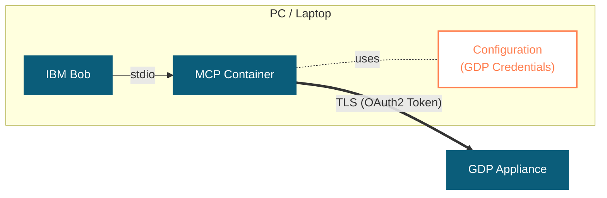
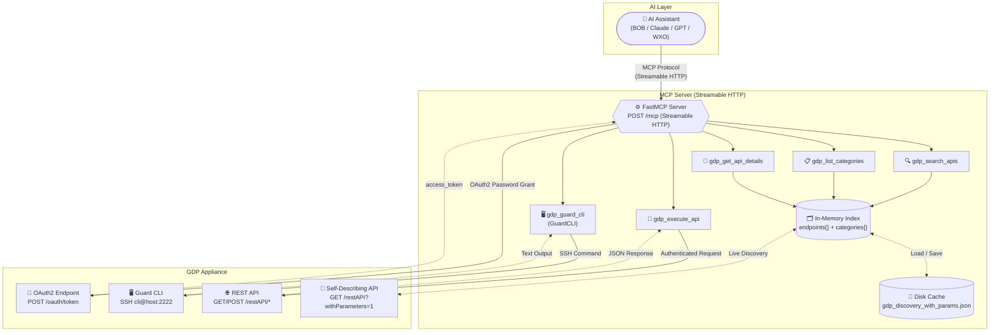
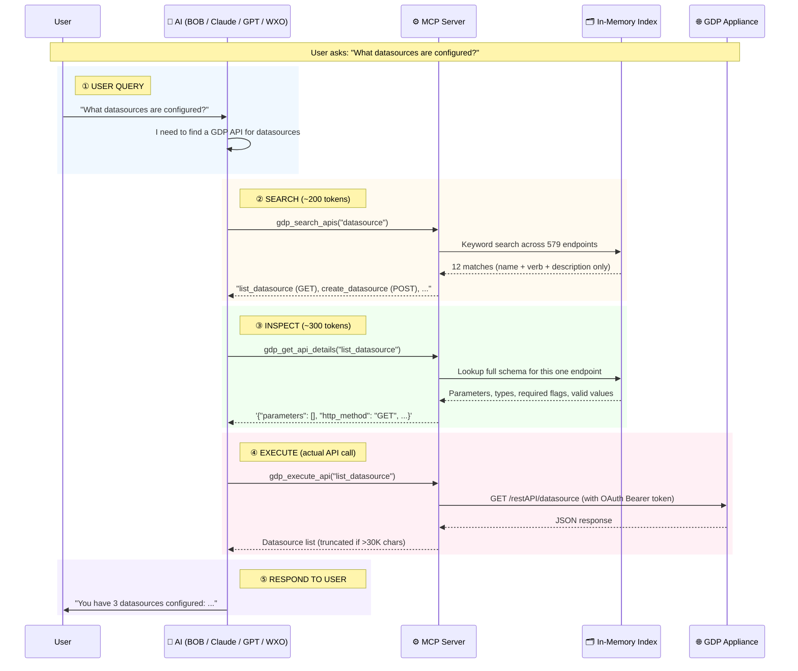
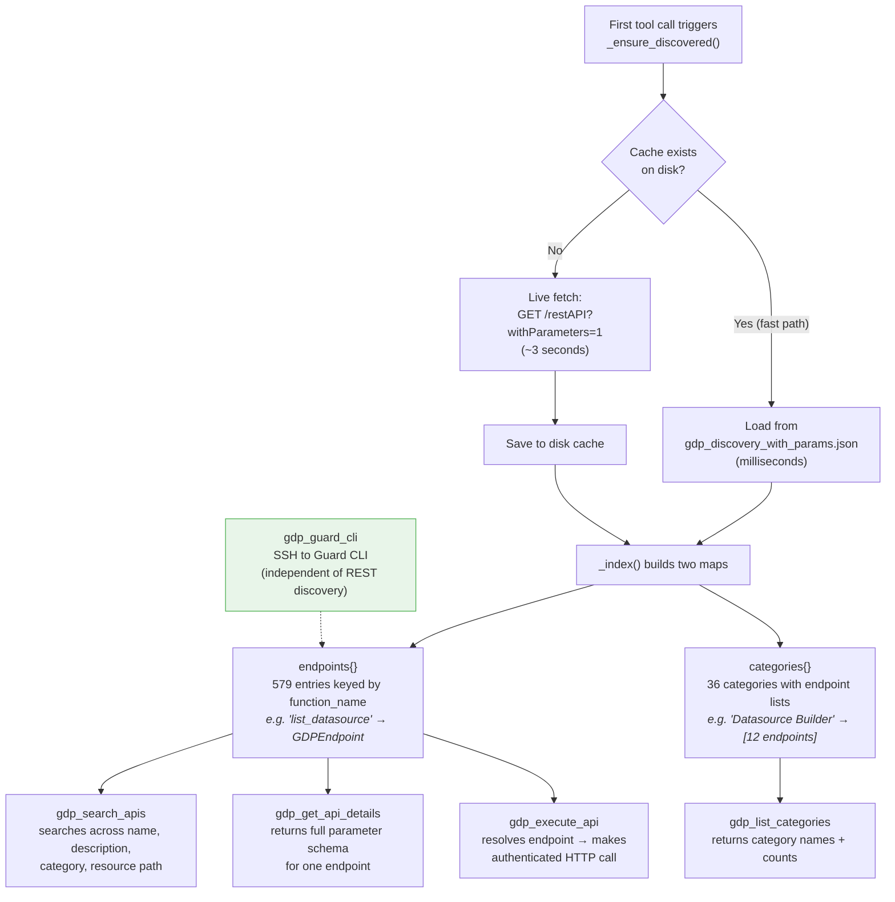
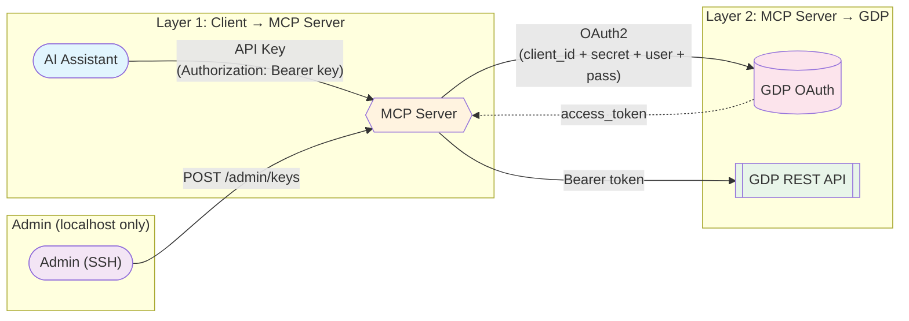
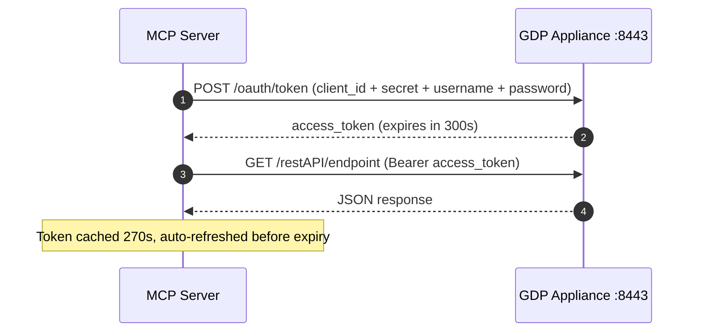

# GDP MCP Server

Model Context Protocol (MCP) server for IBM Guardium Data Protection (GDP).

Access 579+ GDP REST API endpoints and the full Guard CLI through **5 intelligent MCP tools** — with automatic API discovery, multi-appliance routing, MCP resources, completions, report templates, and progress tracking.

> Ask your AI assistant to list monitored datasources, run reports, manage security policies, check S-TAP status, run system diagnostics, restart services — all without writing API calls or navigating the GDP console.

## 🚀 Quick Start - Laptop Deployment (Stdio Mode)

**For IBM Bob users on laptops** - the fastest way to get started:

👉 **[See QUICKSTART.md](QUICKSTART.md)** for a 3-step setup guide.

**Summary:**
1. Clone repo and configure `.env` with GDP credentials
2. Build Docker container: `docker compose build`
3. Add to IBM Bob's MCP config and restart

**Stdio mode benefits:**
- ✅ No API key management needed
- ✅ No network ports to expose
- ✅ Lightweight and secure (process-level isolation)
- ✅ Perfect for laptop/desktop use



---

## V1 vs V2 Feature Comparison

Every feature with a real example showing what it does in practice.

### MCP Spec & Transport

| # | Feature / Spec | V1 | V2 | Real Example |
|---|---------------|:--:|:--:|-------------|
| 1 | **MCP Protocol Version** | 2024-11-05 | 2025-11-25 | V2 uses the latest spec with ToolAnnotations, progress, logging |
| 2 | **STDIO Transport** | Yes | Yes | `gdp-mcp-server` — Claude Desktop connects via stdin/stdout locally |
| 3 | **SSE Transport** | Yes | No | V1: `POST /sse` — replaced by Streamable HTTP in V2 |
| 4 | **Streamable HTTP Transport** | No | Yes | `POST /mcp` — single HTTP endpoint, stateless, load-balancer friendly |
| 5 | **Stateless HTTP** | No | Yes | Each request is independent — no session affinity needed. PUT a load balancer in front |

### Tools

| # | Feature / Spec | V1 | V2 | Real Example |
|---|---------------|:--:|:--:|-------------|
| 6 | **`gdp_search_apis`** | Yes | Yes | `gdp_search_apis("datasource")` → finds `list_datasource`, `create_datasource`, etc. |
| 7 | **`gdp_list_categories`** | Yes | Yes | `gdp_list_categories()` → "Datasource Builder: 12, Policy Builder: 8, …" |
| 8 | **`gdp_get_api_details`** | Yes | Yes | `gdp_get_api_details("list_datasource")` → shows params, types, required flags |
| 9 | **`gdp_execute_api`** | Yes | Yes | `gdp_execute_api("list_datasource")` → calls GDP, returns JSON with all datasources |
| 10 | **`gdp_guard_cli`** (GuardCLI) | No | Yes | `gdp_guard_cli("show system info")` → system version, uptime, hostname over SSH |
| 11 | **ToolAnnotations** | No | Yes | `readOnlyHint=True` on search/list/details — tells the AI these tools don't modify data |
| 12 | **Destructive Command Detection** | No | Yes | `gdp_guard_cli("restart inspection")` → BLOCKED. Must pass `confirm_destructive=True` |
| 13 | **Tool `title` field** | No | Yes | Tool 1 shows as "Search GDP APIs" in Claude's tool panel instead of raw function name |

### Progress, Logging & Errors

| # | Feature / Spec | V1 | V2 | Real Example |
|---|---------------|:--:|:--:|-------------|
| 14 | **`ctx.report_progress()`** | No | Yes | Search tool sends 0/3 → 1/3 → 2/3 → 3/3 — Claude shows a progress bar |
| 15 | **MCP Logging (`ctx.log`)** | No | Yes | `ctx.log("info", "Found 12 endpoints matching 'datasource'")` — visible in VS Code MCP panel |
| 16 | **Structured Error Responses** | No | Yes | `{"error": true, "code": "NOT_FOUND", "message": "...", "suggestion": "Try gdp_search_apis"}` |
| 17 | **Configurable Request Timeout** | No | Yes | `GDP_REQUEST_TIMEOUT=120` — httpx timeout per GDP API call (default 60s, connect 15s) |

### Resources & Completions

| # | Feature / Spec | V1 | V2 | Real Example |
|---|---------------|:--:|:--:|-------------|
| 18 | **MCP Resources** | No | Yes | `gdp://appliances` — Claude's resource panel shows configured appliances with status |
| 19 | **Resource: `gdp://categories`** | No | Yes | Returns JSON `{"categories": {"Datasource Builder": 12, ...}, "total_endpoints": 579}` |
| 20 | **Resource: `gdp://endpoints/{name}`** | No | Yes | `gdp://endpoints/list_datasource` → full schema with all parameters |
| 21 | **Resource: `gdp://server/info`** | No | Yes | Returns server version, feature flags, appliance list, capability summary |
| 22 | **MCP Completions** | No | Yes | Type `appliance=cm` → auto-suggests `cm01`, `cm02` from configured appliances |
| 23 | **Verb Completions** | No | Yes | Type `verb=G` → suggests `GET`. Type `verb=` → shows `GET, POST, PUT, DELETE` |
| 24 | **Category Completions** | No | Yes | Type `category=Data` → suggests `Datasource Builder`, `Data Classification` |
| 25 | **Framework Completions** | No | Yes | Type `framework=GD` → suggests `GDPR` for the compliance report template |

### Report Templates (MCP Prompts)

| # | Feature / Spec | V1 | V2 | Real Example |
|---|---------------|:--:|:--:|-------------|
| 26 | **Security Assessment Report** | No | Yes | Prompt template: gathers datasources + policies + violations → formatted report with recommendations |
| 27 | **Compliance Summary Report** | No | Yes | `compliance_summary_report(framework="SOX")` → SOX-focused compliance gap analysis |
| 28 | **Datasource Inventory Report** | No | Yes | Lists all monitored DBs with host, port, type, status in a formatted table |
| 29 | **Activity Monitoring Report** | No | Yes | Top users, activity by datasource, anomaly flags from GDP monitoring data |
| 30 | **System Health Report** | No | Yes | Calls `gdp_guard_cli("show system info")` + memory + disk → health dashboard |
| 31 | **Vulnerability Assessment Report** | No | Yes | VA findings sorted by severity → Critical/High/Medium with remediation steps |
| 32 | **S-TAP Status Report** | No | Yes | Inspection engine inventory: versions, connectivity, monitored datasources per S-TAP |
| 33 | **Policy Violations Report** | No | Yes | `policy_violations_report(time_period="last 7 days")` → violations by policy/user/severity |

### Architecture & Multi-Appliance

| # | Feature / Spec | V1 | V2 | Real Example |
|---|---------------|:--:|:--:|-------------|
| 34 | **Multi-Appliance Support** | No | Yes | `GDP_APPLIANCES=cm01,cm02,collector01` — one MCP server manages 3 GDP boxes |
| 35 | **Per-Appliance Config** | No | Yes | `GDP_CM01_HOST=10.0.0.1`, `GDP_CM02_HOST=10.0.0.2` — each gets its own credentials |
| 36 | **Appliance Routing** | No | Yes | `gdp_search_apis("datasource", appliance="cm02")` → searches on cm02 specifically |
| 37 | **Lifespan API** | No | Yes | Server startup creates `AppContext` with all appliance connections — no global state |
| 38 | **External Host/Port** | No | Yes | `GDP_EXTERNAL_HOST=proxy.example.com` — for NAT/tunnel/TechZone access |

### Discovery & Caching

| # | Feature / Spec | V1 | V2 | Real Example |
|---|---------------|:--:|:--:|-------------|
| 39 | **Auto-Discovery** | Yes | Yes | First tool call fetches `GET /restAPI?withParameters=1` → indexes 579 endpoints |
| 40 | **Disk Cache** | Yes | Yes | `gdp_discovery_with_params.json` — next startup loads in milliseconds, not 3 seconds |
| 41 | **Per-Appliance Cache** | No | Yes | `gdp_discovery_cm01.json`, `gdp_discovery_cm02.json` — each appliance cached separately |

### Authentication & Security

| # | Feature / Spec | V1 | V2 | Real Example |
|---|---------------|:--:|:--:|-------------|
| 42 | **OAuth2 Token Lifecycle** | Yes | Yes | Auto-acquires token on first call, caches 270s, refreshes 30s before expiry |
| 43 | **API Key Auth (Layer 1)** | Yes | Yes | Client sends `Authorization: Bearer a3f8e9b1...` — server validates against key store |
| 44 | **Admin Key Management** | Yes | Yes | `POST /admin/keys {"user":"alice@ibm.com"}` → returns 64-char hex key (localhost only) |
| 45 | **Key Revocation** | Yes | Yes | `DELETE /admin/keys/a3f8e9b1` → immediately invalidated, next request gets 401 |
| 46 | **SHA-256 Key Hashing** | Yes | Yes | Raw keys never stored — only hashes persist in `/data/keys.json` |
| 47 | **STDIO Auth Exempt** | Yes | Yes | Local stdio transport skips API key check — GDP OAuth2 is the security gate |

### Developer Experience

| # | Feature / Spec | V1 | V2 | Real Example |
|---|---------------|:--:|:--:|-------------|
| 48 | **Health Endpoint** | Yes | Yes | `GET /health` → `{"status":"ok","endpoints":579,"categories":36,"active_keys":2}` |
| 49 | **Response Truncation** | Yes | Yes | API returns >30K chars → truncated with "Showing 50 of 200 results. Use filter params." |
| 50 | **Unit Tests** | No | Yes | `pytest tests/ -v` → 211 tests passing (auth, config, discovery, tools, prompts, resources, completions) |
| 51 | **Docker Support** | Yes | Yes | `docker run -p 8003:8003 --env-file .env ghcr.io/ibm/gdp-mcp-server:latest` |
| 52 | **Python Package** | Yes | Yes | `pip install -e .` → `gdp-mcp-server` CLI command available |

---

## Feature Count Summary

| | V1 | V2 | Delta |
|---|:--:|:--:|:-----:|
| **Tools** | 4 | 5 | +1 (GuardCLI) |
| **MCP Prompts** | 0 | 8 | +8 |
| **MCP Resources** | 0 | 4 | +4 |
| **MCP Completions** | 0 | 1 handler (5 arg types) | +1 |
| **Transports** | STDIO + SSE | STDIO + Streamable HTTP | SSE → Streamable HTTP |
| **Appliances** | 1 | Unlimited | Multi-appliance |
| **Unit Tests** | 0 | 211 | +211 |
| **MCP Spec Version** | 2024-11-05 | 2025-11-25 | Latest |

---

## The 5 Tools

| # | Tool | Channel | What It Does |
|---|------|---------|--------------|
| 1 | `gdp_search_apis` | GuardAPI | Search the full API catalog by keyword, category, or HTTP verb |
| 2 | `gdp_list_categories` | GuardAPI | List all API categories with endpoint counts (bird's-eye view) |
| 3 | `gdp_get_api_details` | GuardAPI | Get full parameter schema for a specific endpoint |
| 4 | `gdp_execute_api` | GuardAPI | Execute any GDP REST API by function name + parameter dict |
| 5 | `gdp_guard_cli` | **GuardCLI** | Execute any Guard CLI command over SSH (system ops, diagnostics, network, backup/restore) |

### Two Channels to GDP

```
┌─────────────────────────────────────────────────────────────┐
│                     GDP MCP Server                          │
│                                                             │
│   GuardAPI (Tools 1-4)          GuardCLI (Tool 5)           │
│   ─────────────────────         ──────────────────          │
│   REST API over HTTPS           CLI over SSH                │
│   579+ endpoints (data ops)     System-level ops            │
│   Reports, policies, groups     Network, backup, diag       │
│   OAuth2 Bearer token           SSH cli@host:2222           │
│   JSON request/response         Text command/output         │
└─────────────────────────────────────────────────────────────┘
```

**Example prompts you can use:**

- *"List all monitored datasources on the GDP appliance"*
- *"Run the 'Database Activity' report on GDP"*
- *"Show all security policies configured on GDP"*
- *"Search for vulnerability assessment APIs"*
- *"Find APIs related to S-TAP inspection engines"*
- *"Get the GDP appliance version and system details"*
- *"What's the system health? Check memory and disk."*
- *"Show the network configuration"*
- *"Restart the inspection engine"* (asks for confirmation — destructive)

Authentication happens automatically — the server authenticates to GDP on first request and refreshes the token as needed. No passwords in your prompts, ever.

### Workflow: REST API (Tools 1-4)

```
User: "Show me all datasources"
  AI:  ① gdp_search_apis("datasource")         → finds "list_datasource"
  AI:  ② gdp_get_api_details("list_datasource") → learns it needs no required params
  AI:  ③ gdp_execute_api("list_datasource")      → gets JSON result
  AI:  ④ Formats and presents the data to the user
```

### Workflow: GuardCLI (Tool 5)

```
User: "What's the system health?"
  AI:  ① gdp_guard_cli("show system info")     → system overview
  AI:  ② gdp_guard_cli("diag system memory")   → memory diagnostics
  AI:  ③ gdp_guard_cli("diag system disk")     → disk usage
  AI:  ④ Summarizes health status to the user

User: "Restart the inspection engine" (destructive!)
  AI:  ① gdp_guard_cli("restart inspection")   → ⚠ BLOCKED (destructive)
  AI:  ② Asks user for confirmation
  AI:  ③ gdp_guard_cli("restart inspection", confirm_destructive=True) → executes
```

---

## Architecture



---

## How Discovery & Search Saves Tokens

The core cost problem with MCP is **tool definitions eat tokens**. Every tool the server registers gets serialized into the LLM's system prompt on every request. Anthropic's own research confirms this — their [Advanced Tool Use](https://www.anthropic.com/engineering/advanced-tool-use) engineering guide recommends keeping tool counts low and using "tool-calling agents that dynamically select from a larger set" rather than dumping hundreds of tools into context.

### The Token Math

```
NAIVE APPROACH (one tool per endpoint):
  579 endpoints × ~8 tokens/tool definition = ~4,600+ tokens
  + Each tool has params, descriptions, enums  = ~12,000-15,000 tokens total
  → Burned on EVERY request, even "hello"

OUR APPROACH (5 tools: 4 GuardAPI + 1 GuardCLI):
  5 tools × ~175 tokens each = ~875 tokens total
  → 94% token savings on every request
```

### How the AI Navigates 579 Endpoints with 5 Tools



### Why This Beats One-Tool-Per-Endpoint

This aligns directly with Anthropic's [Advanced Tool Use](https://www.anthropic.com/engineering/advanced-tool-use) research: fewer tools means higher selection accuracy, lower token overhead, and more reliable agentic workflows.

| Metric | Naive (579 tools) | Ours (5 tools) | Savings |
|--------|-------------------|----------------|---------|
| Tool definition tokens per request | ~15,000 | ~875 | **94%** |
| Tool selection accuracy | ~70% (too many choices) | ~99% (guided workflow) | **+29%** |
| Maintenance on GDP upgrade | Rebuild + redeploy | Zero (auto-discovers) | **100%** |
| API coverage (REST) | Depends on dev effort | 100% always | **Full** |
| CLI/system operations | ❌ Not possible | ✅ Full Guard CLI | **New** |
| Time to support new API | Days (code + test + release) | 0 (live discovery) | **Instant** |

---

## The Discovery Engine

On first tool call, the server fetches GDP's self-describing catalog and builds a searchable in-memory index:



### Key Benefits

- **Token efficiency** — The AI only "downloads" information about the specific endpoints it needs, not all 579. A typical 3-tool-call interaction costs ~1,200 tokens of API metadata vs. ~15,000 if all endpoints were pre-loaded.
- **Self-updating** — When GDP adds new APIs in a future version, the MCP server discovers them automatically. No code changes, no rebuilds, no releases.
- **Offline resilience** — The disk cache means the server works even when the GDP appliance is temporarily unreachable. First startup fetches live, all subsequent loads from cache.
- **Accurate tool selection** — With only 5 tools, the LLM never gets confused about which tool to pick. The search → inspect → execute workflow handles REST, while GuardCLI handles system ops.
- **Full appliance coverage** — REST API for data operations + Guard CLI for system operations. No gap — network config, backup/restore, diagnostics, patch management, inspection engine control are all reachable.
- **Context window protection** — Large responses are auto-truncated at 30K chars with guidance to filter. The AI learns to use parameters efficiently.

---

## Quick Start

```bash
# Clone and install
git clone https://github.ibm.com/ashrivastava/gdp-mcp-server.git
cd gdp-mcp-server
pip install -e .

# Set credentials
export GDP_HOST=<gdp-appliance-host>
export GDP_CLIENT_ID=<oauth-client-id>
export GDP_CLIENT_SECRET=<oauth-client-secret>
export GDP_USERNAME=admin
export GDP_PASSWORD=<password>
export GDP_VERIFY_SSL=false

# Optional: GuardCLI
export GDP_CLI_PASS=<cli-password>

# Run (STDIO — for Claude Desktop, VS Code, etc.)
gdp-mcp-server

# Run (Streamable HTTP — for remote/multi-user)
gdp-mcp-server --transport streamable-http --host 0.0.0.0 --port 8003
```

Full setup instructions in [SETUP_PROCEDURES.md](SETUP_PROCEDURES.md).

---

## Documentation

| Document | What It Covers |
|----------|---------------|
| [SETUP_PROCEDURES.md](SETUP_PROCEDURES.md) | Full setup: OAuth registration, Docker, STDIO, client config |
| [SETUP_GUIDE_DEVAN.md](SETUP_GUIDE_DEVAN.md) | Quick-start guide for new team members |
| [The-Auth-Problum.md](The-Auth-Problum.md) | MCP authentication layers explained — the industry problem at Layer 1 |
| [SECURITY.md](SECURITY.md) | Security policy and vulnerability reporting |
| [CONTRIBUTING.md](CONTRIBUTING.md) | How to contribute |

---

## Component Map

| Component | File | Role |
|-----------|------|------|
| Server & middleware | `src/server.py` | FastMCP setup, Streamable HTTP, API key middleware, lifespan |
| Tool definitions | `src/tools.py` | 5 MCP tools with progress, logging, structured errors |
| Report templates | `src/prompts.py` | 8 MCP Prompt templates for standardized reports |
| Resources | `src/resources.py` | 4 MCP Resources (appliances, categories, endpoints, server info) |
| Completions | `src/completions.py` | Auto-complete for tool arguments (verb, category, appliance, etc.) |
| Discovery engine | `src/discovery.py` | Fetches, indexes, searches the REST API catalog |
| HTTP client | `src/client.py` | Authenticated HTTP with configurable timeouts and auto-retry |
| OAuth2 auth | `src/auth.py` | Token acquisition, caching, 30s-early refresh |
| CLI client | `src/cli.py` | SSH to Guard CLI via paramiko, destructive command detection |
| Configuration | `src/config.py` | Env-var resolution, multi-appliance prefix support |
| Key store | `src/keystore.py` | API key generation, validation, revocation (SHA-256 hashed) |

---

## Security

The MCP server has **two layers of authentication** — one to protect the MCP server itself, and one to authenticate with GDP.



| Layer | What it protects | How it works |
|-------|-----------------|---------------|
| **Layer 1 — MCP API Key** | Prevents unauthorized clients from connecting to the MCP server | Client sends `Authorization: Bearer <key>` header. Server validates against key store. Invalid or missing key → `401 Unauthorized`. |
| **Layer 2 — GDP OAuth2** | Authenticates the MCP server to GDP's REST APIs | Server uses `GDP_USERNAME` + `GDP_PASSWORD` + `GDP_CLIENT_ID` + `GDP_CLIENT_SECRET` to get an OAuth2 token. Token auto-refreshes every 5 min. |

### API Key Management

API keys are managed via **localhost-only admin endpoints**. You must be on the server (SSH) to create, list, or revoke keys.

| Method | Endpoint | Action |
|--------|----------|--------|
| `POST` | `/admin/keys` | Generate a new API key for a user |
| `GET` | `/admin/keys` | List all active keys (masked) |
| `DELETE` | `/admin/keys/{key_prefix}` | Revoke a key |

All `/admin/*` requests from non-localhost IPs → **403 Forbidden**.

**Key storage:** Keys are stored as SHA-256 hashes in `/data/keys.json`. Raw keys are shown once at generation time and never stored or retrievable again. Mount a persistent volume at `/data` to preserve keys across container restarts.

> **stdio transport is exempt** from API key validation — the user runs the process locally with their own GDP credentials; GDP's own OAuth2 authentication (Layer 2) is the security gate.

### Key Rotation & Revocation

**List active keys:**

```bash
curl -s http://localhost:8003/admin/keys | jq .
```

```json
[
  {"user": "alice@ibm.com", "key_prefix": "a3f8e9b1", "created": "2026-02-20T14:30:00Z"},
  {"user": "bob@ibm.com",   "key_prefix": "c5d2f7e3", "created": "2026-02-20T15:00:00Z"}
]
```

**Revoke a key:**

```bash
curl -s -X DELETE http://localhost:8003/admin/keys/a3f8e9b1
```

The key is immediately invalidated — the user's next request will get `401 Unauthorized`. No server restart needed.

**Generate a replacement:**

```bash
curl -s -X POST http://localhost:8003/admin/keys \
  -H "Content-Type: application/json" \
  -d '{"user": "alice@ibm.com"}' | jq .
```

| Situation | Action |
|-----------|--------|
| Key compromised or leaked | Revoke immediately, generate new |
| User leaves the team | Revoke their key |
| Scheduled rotation | Generate new key, update client, then revoke old key |
| Lost key (user forgot it) | Revoke the old key by prefix, generate a new one |

---

## GDP Authentication

GDP uses per-appliance OAuth2 with the password grant. Each appliance (Central Manager or Collector) has its own OAuth client registration — tokens are not portable across appliances.

The MCP server handles this entirely for you. Credentials are set once in environment variables — you never include passwords in your prompts or tool calls.



| Step | What happens |
| ---- | --------------------------------------------------------------------- |
| 1 | MCP Server sends GDP credentials + OAuth client credentials to the GDP appliance |
| 2 | GDP validates and returns an `access_token` (expires in 300 seconds) |
| 3 | MCP Server makes the actual API call with the Bearer token |
| 4 | GDP returns the JSON response |

### Credentials You Need

| Credential | Purpose | How to Obtain |
| --- | --- | --- |
| **GDP_USERNAME / GDP_PASSWORD** | Your identity for GDP | Your GDP admin login credentials |
| **GDP_CLIENT_ID / GDP_CLIENT_SECRET** | OAuth2 client registration | `grdapi register_oauth_client` on the GDP appliance CLI (see [SETUP_PROCEDURES.md](SETUP_PROCEDURES.md)) |

**Why two sets?** Your username/password prove *who you are*. The client ID/secret prove *which application* is requesting the token. GDP's OAuth2 layer requires both to issue an access token.

---

## Report Templates

The server includes **8 built-in report templates** implemented as MCP Prompts. These ensure that the same report produces the same professional format every time — critical for demos, partner presentations, and consistent deliverables.

### Available Templates

| # | Template | What It Covers |
|---|----------|---------------|
| 1 | **Security Assessment** | Comprehensive security posture: datasources, policies, violations, system health, recommendations |
| 2 | **Compliance Summary** | Policy coverage, monitoring coverage, violation categories, compliance gaps, remediation |
| 3 | **Datasource Inventory** | All monitored datasources with types, hosts, ports, status, connectivity |
| 4 | **Activity Monitoring** | Database activity volume, top users, activity by datasource, anomalies |
| 5 | **System Health** | CPU, memory, disk, network, running processes, S-TAP status (via Guard CLI) |
| 6 | **Vulnerability Assessment** | VA scan results by severity, findings by datasource, remediation priority |
| 7 | **S-TAP Status** | Inspection engine inventory, connectivity, versions, monitored datasources |
| 8 | **Policy Violations** | Violations by policy/severity/user/datasource, trends, remediation actions |

### How to Use

**Option 1 — Select from the prompt picker** (Claude Desktop shows a 📎 icon with available prompts):

Select a template → fill in optional parameters (appliance name, time period) → the AI generates the full report.

**Option 2 — Ask naturally:**

> *"Generate a Security Assessment Report for my GDP appliance"*
> *"Create a System Health Report"*
> *"Run a Datasource Inventory Report on cm01"*

### What You Get

Each template produces a report with:

- **Header** — report type, timestamp, appliance, generator attribution
- **Data sections** — real data from GDP tools, formatted as tables
- **Analysis** — health indicators (✅/⚠️/🔴), coverage percentages, trends
- **Recommendations** — prioritized by impact (Critical / High / Medium)
- **Footer** — live data disclaimer

### Why Templates Matter

Without templates, five different people generate five different reports from the same data. Templates enforce:

- Same sections in the same order
- Same table formats and column headers
- Same severity thresholds and status indicators
- Same recommendation structure
- Professional, demo-ready output every time

---

## Available API Categories

The GDP REST API spans 579+ endpoints across ~36 categories. Here are some examples:

| Category | What you can manage | Example prompt |
|----------|-------------------|----------------|
| Datasource Builder | Monitored data sources | *"List all monitored datasources"* |
| Policy Builder | Security policies, rules | *"Show all security policies configured on GDP"* |
| Group Builder | Groups and group members | *"Show all groups defined in GDP"* |
| Report | Reports, queries, results | *"Run the 'Database Activity' report"* |
| Vulnerability Assessment | VA scans, results | *"Search for vulnerability assessment APIs"* |
| S-TAP | Inspection engines, monitoring | *"Find APIs related to S-TAP inspection engines"* |
| Classification | Data classification policies | *"Search for data classification APIs"* |
| User Management | Users, roles, permissions | *"List all GDP users and their roles"* |
| System | Appliance info, configuration | *"Get the GDP appliance version and system details"* |

---

## Configuration Reference

### Single-Appliance Mode (Default)

| Variable | Required | Default | Description |
|----------|----------|---------|-------------|
| `GDP_HOST` | Yes | — | GDP appliance IP or hostname |
| `GDP_PORT` | No | `8443` | GDP REST API port |
| `GDP_EXTERNAL_HOST` | No | — | External hostname (for cloud / NAT / tunnel access) |
| `GDP_EXTERNAL_PORT` | No | — | External port (preferred over `GDP_PORT` if set) |
| `GDP_CLIENT_ID` | Yes | — | OAuth client ID from `register_oauth_client` |
| `GDP_CLIENT_SECRET` | Yes | — | OAuth client secret from `register_oauth_client` |
| `GDP_USERNAME` | Yes | — | GDP admin username |
| `GDP_PASSWORD` | Yes | — | GDP admin password |
| `GDP_VERIFY_SSL` | No | `false` | SSL certificate verification |
| `GDP_CLI_HOST` | No | `GDP_HOST` | Guard CLI SSH host (defaults to `GDP_HOST` if not set) |
| `GDP_CLI_PORT` | No | `2222` | Guard CLI SSH port |
| `GDP_CLI_USER` | No | `cli` | Guard CLI SSH username |
| `GDP_CLI_PASS` | No | — | Guard CLI SSH password (enables `gdp_guard_cli` tool) |
| `GDP_REQUEST_TIMEOUT` | No | `60` | HTTP request timeout in seconds |
| `MCP_TRANSPORT` | No | `stdio` | Transport mode: `stdio` or `streamable-http` |
| `MCP_HOST` | No | `0.0.0.0` | Bind address for streamable-http mode |
| `MCP_PORT` | No | `8003` | Port for streamable-http mode |
| `GDP_MCP_KEY_STORE_PATH` | No | `/data/keys.json` | Path to the API key store file |
| `LOG_LEVEL` | No | `INFO` | Logging level |

### Multi-Appliance Mode

Manage multiple GDP appliances from a single MCP server. Set `GDP_APPLIANCES` to a comma-separated list of names, then use prefixed env vars for each:

| Variable | Description |
|----------|-------------|
| `GDP_APPLIANCES` | Comma-separated appliance names (e.g. `cm01,cm02,collector01`). The first name is the default. |
| `GDP_<NAME>_HOST` | Host for appliance `<NAME>` (falls back to `GDP_HOST`) |
| `GDP_<NAME>_PORT` | Port for appliance `<NAME>` (falls back to `GDP_PORT`) |
| `GDP_<NAME>_CLIENT_ID` | OAuth client ID (falls back to `GDP_CLIENT_ID`) |
| `GDP_<NAME>_CLIENT_SECRET` | OAuth client secret (falls back to `GDP_CLIENT_SECRET`) |
| `GDP_<NAME>_USERNAME` | Username (falls back to `GDP_USERNAME`) |
| `GDP_<NAME>_PASSWORD` | Password (falls back to `GDP_PASSWORD`) |
| `GDP_<NAME>_CLI_PASS` | CLI password (falls back to `GDP_CLI_PASS`) |

**Example — two central managers with shared credentials:**

```bash
GDP_APPLIANCES=cm01,cm02
GDP_USERNAME=admin
GDP_PASSWORD=Guardium@123
GDP_CLIENT_ID=gdp_mcp
GDP_CLIENT_SECRET=<secret>

# Only override what differs per appliance
GDP_CM01_HOST=cm01.example.com
GDP_CM02_HOST=cm02.example.com
GDP_CM02_PORT=9443
```

All 5 tools accept an optional `appliance` parameter. Omit it to use the default (first in the list):

```
gdp_search_apis(query="datasource", appliance="cm02")
gdp_guard_cli(command="show system info", appliance="cm01")
```

---

## Getting Started

**Three roles are involved:**

| Role | What they do | Access needed |
|------|-------------|---------------|
| **GDP Admin** | Registers OAuth client on the GDP appliance | SSH to GDP appliance CLI |
| **MCP Server Admin** | Deploys the container, configures env vars, generates/revokes API keys | SSH to MCP server host |
| **Client (end user)** | Pastes API key + URL into their AI assistant config, starts chatting | Just the key and the URL |

The setup flow:

1. **Register OAuth client** on the GDP appliance (`grdapi register_oauth_client`)
2. **Pull the container** from `ghcr.io/ibm/gdp-mcp-server:latest`
3. **Run the container** with GDP credentials as environment variables
4. **Verify** via `/health` endpoint
5. **Generate API keys** for each client via `/admin/keys`

> Full step-by-step instructions in **[SETUP_PROCEDURES.md](SETUP_PROCEDURES.md)**.

### Client Setup

You need two things from the MCP Server Admin:

1. **Server URL** — e.g., `http://<mcp-server-host>:8003/mcp`
2. **API Key** — the 64-character hex string generated for you

Client configuration for **Claude Desktop**, **IBM Bob**, and **stdio mode** is covered in **[SETUP_PROCEDURES.md](SETUP_PROCEDURES.md)**.

After configuring, try this prompt to verify:

> *"Use the GDP MCP server to list all available API categories"*

You should see 579+ endpoints across ~36 categories.

---

## Image Tags

| Tag | Description |
|-----|-------------|
| `latest` | Current release with API key authentication (recommended) |
| `v1.0.0` | Original release — SSE transport, no API key auth |

> **Recommendation:** Always use `latest` in production. The `v1.0.0` tag is preserved for reference and rollback only.

---

## Troubleshooting

| Problem | Cause | Fix |
|---------|-------|-----|
| `401 Unauthorized` on `/mcp` connect | Missing or wrong API key | Check `Authorization: Bearer <key>` header in your config |
| `403 Forbidden` on `/admin/keys` | Calling admin endpoint from non-localhost | SSH into the server first, or use an SSH tunnel: `ssh -L 8003:localhost:8003 root@<host>` |
| Health shows `active_keys: 0` | No keys generated yet | Run `POST /admin/keys` from localhost |
| Keys lost after container restart | No persistent volume | Recreate container with `-v gdp-mcp-data:/data` |
| `Connection refused` on port 8003 | Container not running | Check `docker ps` and `docker logs gdp-mcp-server` |
| GDP login fails (OAuth error) | Wrong credentials or GDP unreachable | Verify env vars in `docker inspect gdp-mcp-server` |
| SSL certificate errors | Self-signed cert on GDP appliance | Set `GDP_VERIFY_SSL=false` |
| No endpoints discovered | OAuth client not registered | SSH into GDP CLI and run `grdapi register_oauth_client` |
| TechZone connection fails | Using internal hostname instead of external | Set `GDP_EXTERNAL_HOST` and `GDP_EXTERNAL_PORT` |
| Guard CLI not available | `GDP_CLI_PASS` not set | Set `GDP_CLI_PASS` in your `.env` or environment |
| Guard CLI connection refused | Wrong host/port or appliance unreachable | Verify `GDP_CLI_HOST` and `GDP_CLI_PORT` (default: 2222) |

---

## Quick Reference

```
Admin: ssh root@<mcp-server-host>

Generate key:   curl -s -X POST http://localhost:8003/admin/keys -H "Content-Type: application/json" -d '{"user":"name@co.com"}'
List keys:      curl -s http://localhost:8003/admin/keys
Revoke key:     curl -s -X DELETE http://localhost:8003/admin/keys/<prefix>
Health check:   curl -s http://localhost:8003/health
Container logs: docker logs gdp-mcp-server --tail 50
```

---

## Resources

- [IBM Guardium Data Protection Documentation](https://www.ibm.com/docs/en/guardium)
- [GDP REST API Reference](https://www.ibm.com/docs/en/guardium/12.x?topic=reference-rest-api)
- [Container Image on ghcr.io](https://github.com/orgs/IBM/packages/container/package/gdp-mcp-server)
- [MCP Protocol Specification](https://modelcontextprotocol.io/)
- [Anthropic Advanced Tool Use](https://www.anthropic.com/engineering/advanced-tool-use)

---

## Support (Upstream)

**Found a bug?** [Open an issue](https://github.com/IBM/gdp-mcp-server/issues/new) with steps to reproduce and server logs.

**Feature request?** [Open an issue](https://github.com/IBM/gdp-mcp-server/issues/new) with `[Feature Request]` prefix.

**Questions?** Check [existing issues](https://github.com/IBM/gdp-mcp-server/issues) or open a new one.

---

## IBM Public Repository Disclosure (Upstream)

All content in this repository including code has been provided by IBM under the associated open source software license and IBM is under no obligation to provide enhancements, updates, or support. IBM developers produced this code as an open source project (not as an IBM product), and IBM makes no assertions as to the level of quality nor security, and will not be maintaining this code going forward.
